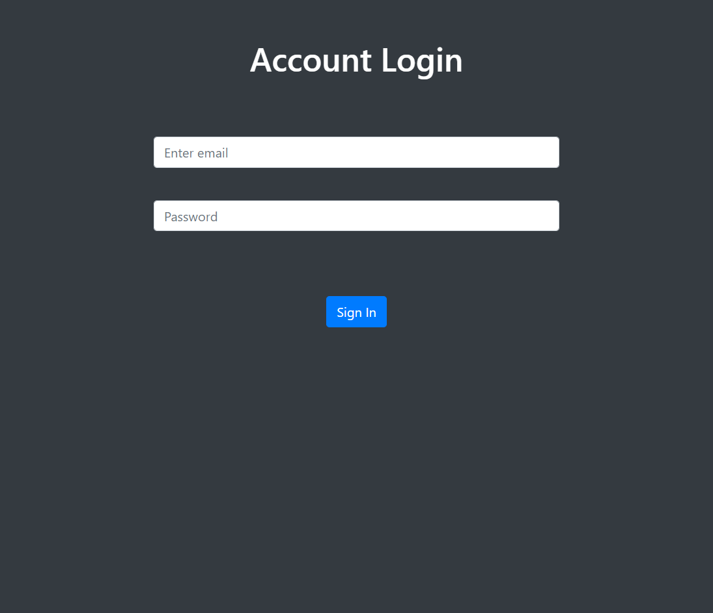

# 登入功能: 帳密檢查機制

用 Node.js 搭配 Express 框架建立的簡易登入介面

## 畫面



## 環境建置與需求

node.js v10.15.0 -執行環境 express v4.14.7 -框架 express-handlebars v4.0.4 -模板引擎

## 安裝與使用

下載專案

```bash
git clone https://github.com/Mia-Chen-taiwan/account_login.git
```

安裝package

```bash
npm install
```

使用nodemon啟動伺服器

```bash
npm run dev
```

或正常啟動

```bash
npm start
```